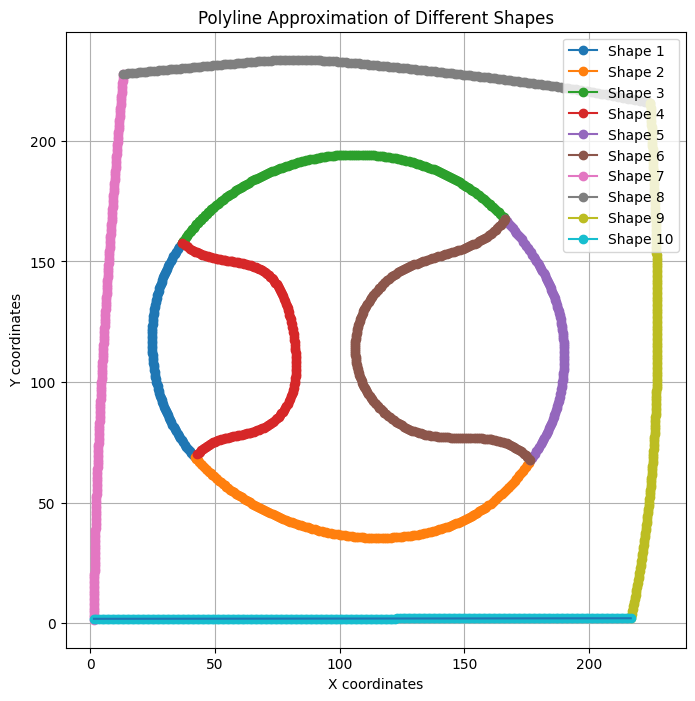
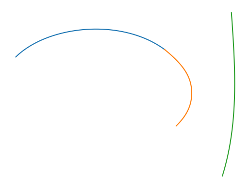
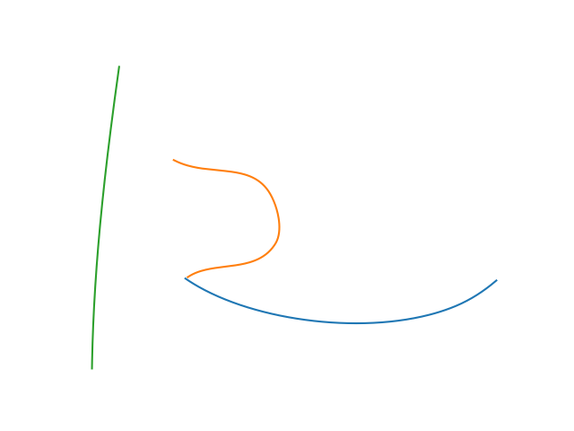
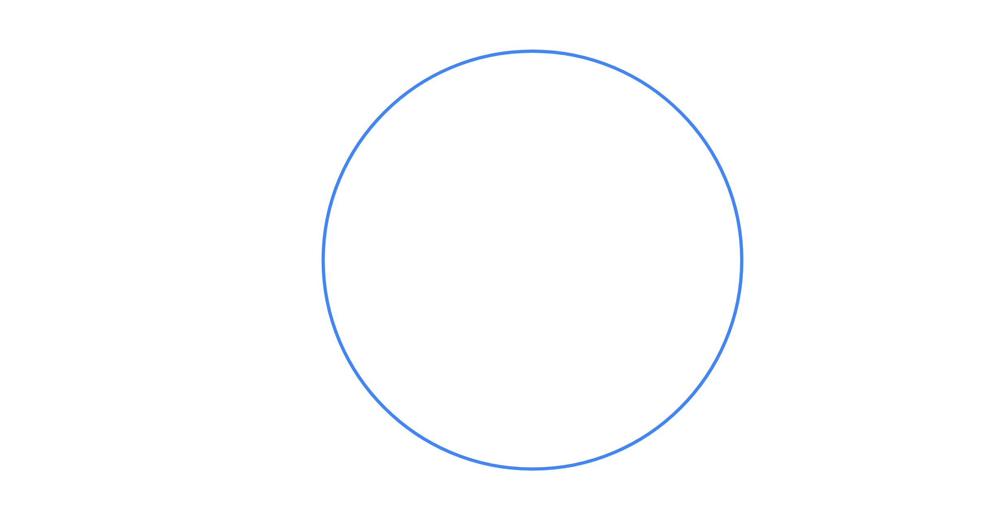
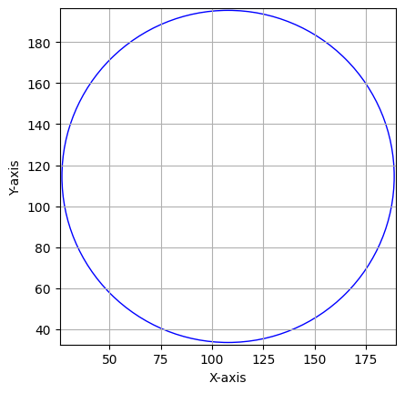
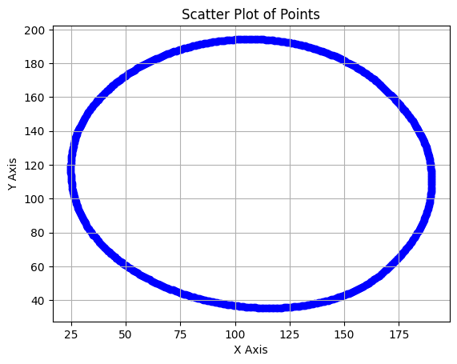
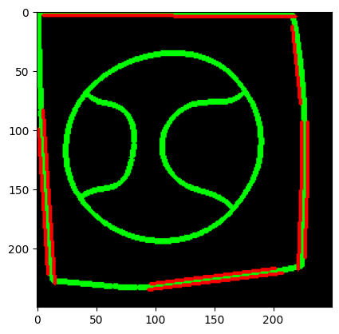

# Curvetopia

## 1. Problem Statement

Welcome to "Curvetopia," a project dedicated to the regularization, symmetry detection, and completion of 2D curves in Euclidean space. We aim to transform hand-drawn shapes and doodles into their ideal geometric forms. This includes turning irregular polylines into perfect curves defined as sequences of cubic Bezier curves, thereby enhancing both the aesthetic and the structural integrity of the input figures.

## 2. Given Data

The primary data format for this project is a CSV file that describes the polylines of hand-drawn curves. This file includes four columns:

- Column 1: Arc or segment number, unique for each discrete polyline.
- Column 2: Z-index, which aids in tasks requiring depth or occlusion awareness.
- Column 3 and 4: X and Y coordinates of the polyline points, defining the path of the curve in a 2D space.

This structured data approach allows us to directly manipulate and analyze the curves based on their geometric properties.

## 3. Solution to Part 1: Regularization
<ol type='i'>
<li>Combination Generation:
Using itertools, we generate all possible combinations of segments. This is crucial for analyzing potential shapes that may form from seemingly disconnected lines.

<li>Classification:
Each combination of segments is passed through a classifier leveraging a pre-trained ResNet-18 model. This model outputs a feature vector, which is then compared via cosine similarity to pre-stored class feature vectors representing 22 standardized shapes. These shapes range from simple lines to complex star shapes, all standardized in Google Autodraw.

<li>Shape Standardization:
Once a shape is recognized, it is substituted with a regularized version (perfect geometric shape) which is then adjusted back to match the scale and position of the original input using mean and standard deviation normalization techniques.

</ol>

## 4. Solution to Part 2: Symmetry
For detected shapes, symmetry lines retained from the classification process are applied. This involves checking for mirrored halves of the shape and aligning them perfectly to enhance the symmetry, which is especially critical for complex shapes like stars or polygons.

## 5. Solution to Part 3: Occlusion
A novel approach to address occlusion involves:

Connecting endpoints of occluded shapes with straight lines.
Classifying these newly formed shapes using the established classifier but at a lower threshold, allowing for the creation of a complete shape despite initial occlusions.

## 6. Extra Ideas and Future Scope
<ol type='i'>
<li>Circle Regularization:
For near-circular shapes, applying a least squares fitting method could refine the shape to a perfect circle, unless outliers disrupt the fit.

<li>Outlier Handling with RANSAC:
For shapes with outliers, RANSAC (Random Sample Consensus) could be employed to selectively ignore outliers and fit the remaining points to a lower-degree curve, enhancing the overall shape prediction.

<li>Straight Line Completion:
Simple connections can be made between endpoints of linear segments to form complete and straight lines.

</ol>

## Future Ideas:

- Implementing machine learning models that can predict the type of curve based on partial data.
- Exploring more advanced geometric transformations and their applications in graphic design and computer vision.

## Conclusion
Curvetopia stands at the intersection of geometry, art, and technology, presenting a unique solution to regularizing, symmetrizing, and completing 2D curves. Our approach not only enhances the visual appeal of hand-drawn art but also contributes to better understanding and processing of geometric data in digital formats. Through ongoing development and refinement, Curvetopia aims to set new standards in the automation of drawing and design tasks.
